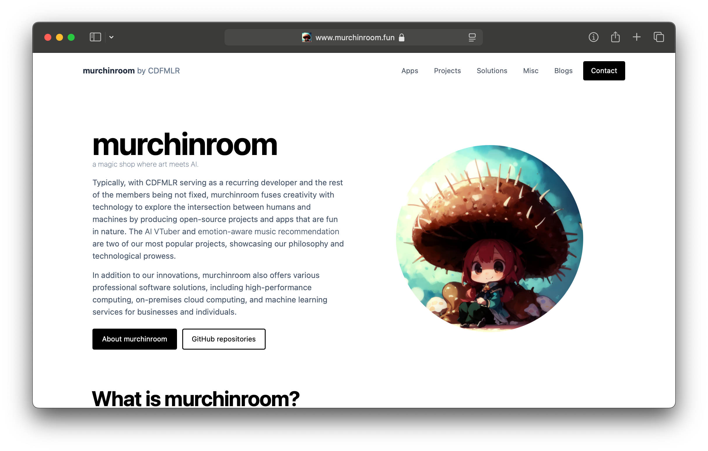
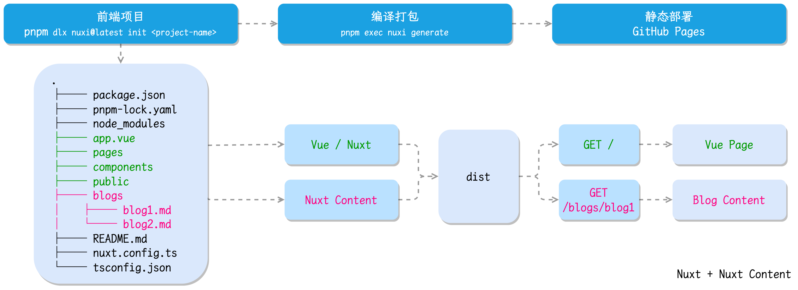
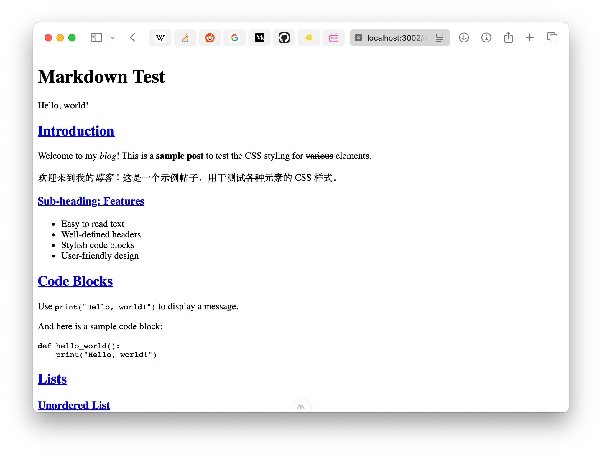
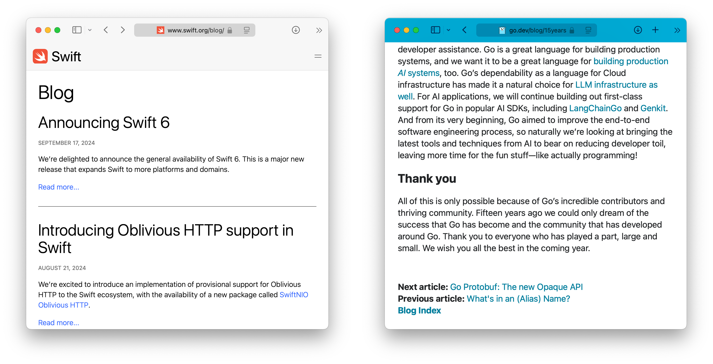
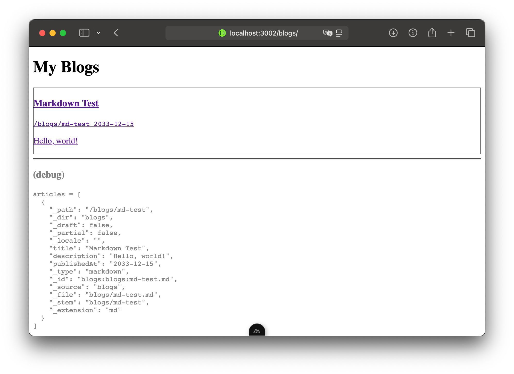
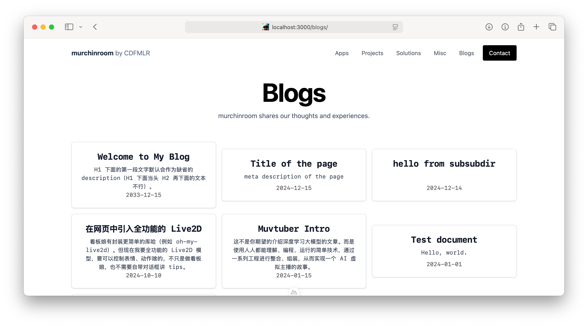
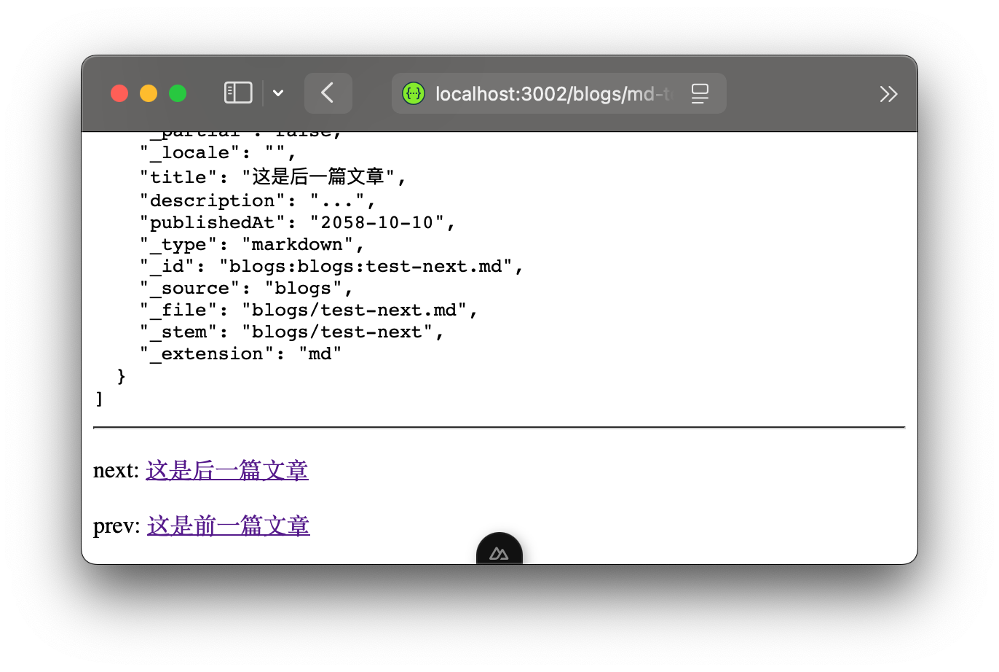
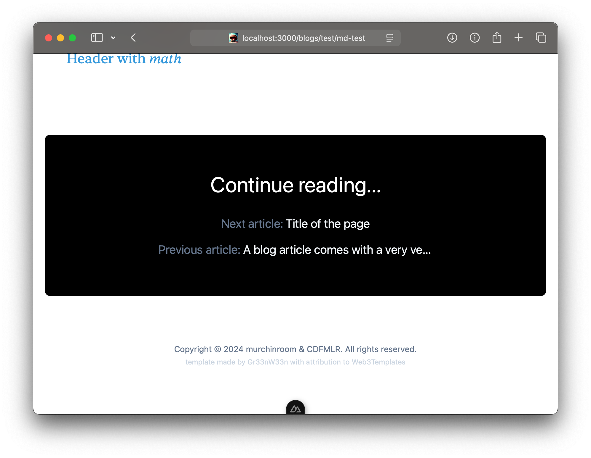
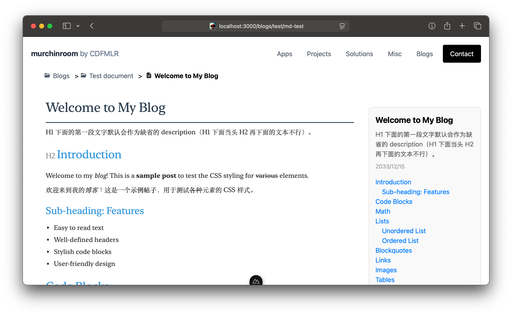

# 用 Nuxt Content 搭建 Blog 系统

为 Nuxt 站点增添由 Markdown 撰写的内容页面。

## 故事背景和 Nuxt

之前有一段时期，我特别痴迷于 [Nuxt](https://nuxt.com)，把各种个人和工作的新项目，都推向了使用 Nuxt 的深渊。

Nuxt 在官网给自己贴的标签是 「The Intuitive Vue Framework」。实际用起来也确实是个非常直接、简单的框架呢，对得起这个名号。在符合直觉的用途下，该框架的行为和方式都很符合直觉。如果项目的架构可控，可以完全按照 Nuxt 的方式来玩，熟悉起来之后还是能节省一点点心智负担的（用起来有种 [FastAPI](https://fastapi.tiangolo.com) 的美感）。

不过组件库缺失还是有点烦，还得上另一家的组件库，总之就是非常 NTR。等一下，我是不是忽略了 [Nuxt UI](https://ui.nuxt.com)？这东西，你用一次就知道了，Nuxt UI 基础版还是有很多功能缺失的——所以说真用来工作还是不如老当益壮的 [Quasar](https://quasar.dev) 全家桶有安全感捏。（但话说我是真的馋 Nuxt UI Pro，看文档嘎嘎香，之后还是得想办法搞一个来玩玩。）

当然我也尝试了不用组件库，[Tailwind CSS](https://tailwindcss.com) 硬上，把丢掉的手艺活全捡回来。。体验嘛，对我这种偶尔写点老气中后台、内部临时小 demo 和个人破玩具的全栈开发来说，只能说是自讨苦吃。（昨天我发现了 [daisyUI](https://daisyui.com) 也感觉比较有意思，直击手搓 Tailwind 的痛点，之后试试。）

目前新的 [murchinroom 主页](https://www.murchinroom.fun)就是徒手 Tailwind 的一个例子（也不能说完全徒手叭，还是上了模版的）。


但前面说的这些都**不是**重点。只是好长时间没写过东西了，单纯想唠叨一下，诶嘿。

总之，这篇文章要讲的故事是，为了给这个新的 murchinroom 主页增加博客功能，我研究了一下 Nuxt Content。 

## Nuxt Content

我们都知道，如果要从头写一个纯内容的站点，例如文档或者博客站，动态的 [WordPress](https://wordpress.com)，或者静态的 [Hugo](https://gohugo.io) 才是久经考验的最佳时间。而如果你希望更现代一些[VitePress](https://vitepress.dev)， 或者让我们更激进一些 [Astro](https://astro.build) 才是更好的选择。

但有时候我们也得给已有的站点加入动态内容模块。例如给基于 Nuxt 的 [murchinroom 主页](https://www.murchinroom.fun) 增加博客模块。这个时候如果还选择上述的完整站点解决方案，就不得不掏出祖传秘方——iframe 或者直接跨站点链接跳转了，总之实现上不太优雅，你维护起来更加“救命呀！”

我还是希望能在一个站点中，既有原来 Vue 写的静态或动态内容，又有一部分解析来自同一个源码目录树下的 Markdown 文档，形成博客内容。

这就是 [Nuxt Content](https://content.nuxt.com) 的用武之地。

> Nuxt Content 会读取你项目中的 `content/` 目录，解析 `.md`、`.yml`、`.csv` 和 `.json` 文件，为你的应用创建一个强大的数据层。你还可以使用 MDC 语法在 Markdown 中使用 Vue 组件。
> —— Nuxt Content 官网机翻

总之就是说，这东西能从你 src 里读 Markdown 文档，和一些数据文件，形成渲染好的页面，提供查询和展示功能。具体来说，对于我们的博客建设需求，就可以把博客内容的 Markdown 文档，放到站点源码的 `blogs/` 目录里，编译时，Nuxt Content 会把这些 markdown 一并渲染好，成为站点的博客内容页面。整个过程相当静态，有一种编译 Go 语言程序，在其中 embed 一些 static 内容的美感。



由于官方的文档有一点点草率，例子和脚手架参考价值都有限。所以还是自己写一篇介绍一下我的实践。

## Content 安装

此处仅介绍在现有 Nuxt 项目中添加 Content 模块，官方也有提供新建项目的脚手架，需要的读者可以参考文档。

> 文档：[https://content.nuxt.com/get-started/installation](https://content.nuxt.com/get-started/installation)

添加包：

```sh
pnpx nuxi module add content
```

修改项目配置：`nuxt.config.ts`，在 `modules` 里面增加 content：

```sh
export default defineNuxtConfig({
  modules: [
    '@nuxt/content'
  ],
})
```

## Content 配置

> 文档：[https://content.nuxt.com/get-started/configuration](https://content.nuxt.com/get-started/configuration)

还是在 `nuxt.config.ts`，增加一坨对 Content 的配置：

```ts
import { resolve } from "node:path";

export default defineNuxtConfig({
  content: {
    sources: {
      blogs: {
        prefix: '/blogs/',
        driver: 'fs',
        base: resolve(__dirname, 'public/blogs')
      }
    },
    highlight: {
      langs: ['c', 'go', 'js', 'py', 'sh'],
      theme: 'github-light',
    },
    markdown: {
      rehypePlugins: {
        "rehype-katex": { output: 'mathml' }
      },
      remarkPlugins: [
        'remark-math'
      ],
    },
  },
})
```

上面是一些基本的、常用的配置。下面我们一项项详细介绍。

### sources

`content.source` 配置 Nuxt Content 要读取的内容源。

```ts
export default defineNuxtConfig({
  content: {
    sources: {
      blogs: {
        prefix: '/blogs/',
        driver: 'fs',
        base: resolve(__dirname, 'public/blogs')
      }
    },
  },
})
```

> 文档：[https://content.nuxt.com/get-started/configuration#sources](https://content.nuxt.com/get-started/configuration#sources)

默认的源是项目源码根目录下的 `content/` 目录，映射到路由 `/content`。如果不想用默认的，不要创建这个目录就行。

除了默认的，还可以添加多个自定义的源。例如，上面的例子中，创建了一个叫做 `blogs` 的源，使用 `fs` driver，即读取本地源文件，将 `public/blogs` 下的内容（Markdown 文档）映射到 `/blogs` 路由下：

|     | src                    | --> | dist         |
| :-: | ---------------------- | :-: | ------------ |
| 类型  | Markdown 文件            | --> | 页面路由         |
| 路径  | /public/blogs/xx/yy.md | --> | /blogs/xx/yy |

这里我做了一个不太常规的事：把 `base` 配置到了 `public/` 目录下。

我们知道 `public/` 目录下的东西会在编译打包时，被全部无脑扔到生成的 dist 目录中。把 Content 源放在这个目录下，带来了两个好处：

- 可以把 Markdown 文档需要的附件（主要是图片），和 Markdown 文档本身放到同一个目录下，用相对路径去引用。这是我惯用的组织方式，因为它通常能够完美适配各种编辑器和 Git 仓库，而无需任何特殊设置。
- 用户在访问系统时，可以通过在博客页面 URL 后面加上 `.md` 访问到未经渲染的博客源文件，这可能对于一些有特殊癖好的用户（例如希望把看到的东西保存到自己的文档库中）或者非人类用户（我向来主张平等对待来自机器和人类的所有善意访问）提供一些便利。

⚠️ 但这也会引入一个**缺陷**：

- 源中的所有文章，即便是没有准备好发布的，只要加到源里了，项目打包过后，就可以使用加 `.md` 的方式访问到。

这可能不是一些用户期望的行为。但对于我的需求来说，反正一整个 [murchinroom-web](https://github.com/murchinroom/murchinroom-web)  都是开源的，本来也就完全不设防，所以无所谓。

### highlight

毕竟是开发者，博客难免要有代码块，语法高亮不能少。

```ts
export default defineNuxtConfig({
  content: {
    highlight: {
      langs: ['c', 'go', 'js', 'py', 'sh', '总之就是你用的各种语言'],
      theme: {
        default: 'github-light', // Default theme
        dark: 'github-dark', // Theme used if `html.dark`
      },
    },
  },
})
```

> 文档: https://content.nuxt.com/get-started/configuration#highlight

你需要把需要用到的各种语言都加到 `langs` 数组中，Nuxt Content 才会高亮对应语言的代码块。同时你也可以配置你喜欢的代码块主题。语法高亮使用的是 [shiki](https://github.com/shikijs/shiki) ，所以：

- langs：支持的语言列表在这里: [tm-grammars](https://github.com/shikijs/textmate-grammars-themes/tree/main/packages/tm-grammars)
- theme：支持的主题列表在这里：[tm-themes](https://github.com/shikijs/textmate-grammars-themes/tree/main/packages/tm-themes)

向我们这种杂食小丑，写的语言可能有一点多，一时半会儿也想不全，全加上好像又会增大一点点体积？所以下面这串命令可能可以帮你从一个现有的 Markdown 仓库中，挖掘出你到底写过哪些语言：

```sh
grep -IRn '```' | grep -v '```$' | grep '.md:' | grep -v '/plugins' | cut -d'`' -f4 | tr '[:upper:]' '[:lower:]' | sort | uniq | xargs
```

### 数学支持

基于 $\TeX$ 的公式支持也是我觉得常用的一个点，这个功能可以通过增加 markdown 插件来实现。

```ts
export default defineNuxtConfig({
  content: {
    markdown: {
      rehypePlugins: {
        "rehype-katex": { output: 'mathml' }
      },
      remarkPlugins: [
        'remark-math'
      ],
    },
  },
})
```

> 参考讨论: https://github.com/nuxt/content/discussions/2561

Nuxt Content 处理 Markdown 时，可以用 [remark](https://github.com/remarkjs/remark) 和 [rehype](https://github.com/rehypejs/rehype) 插件。

- [remark](https://github.com/remarkjs/remark) is a tool that transforms markdown with plugins. These plugins can inspect and change your markup.
- [rehype](https://github.com/rehypejs/rehype) is a tool that transforms HTML with plugins. These plugins can inspect and change the HTML. 
- [remark-rehype](https://github.com/remarkjs/remark-rehype) is a remark plugin that turns markdown into HTML to support rehype.

这套系统的插件就很丰富了。我们通过引入 `remark-math` 和 `rehype-katex` 就能把 Markdown 中的 LaTeX 数学公式渲染为人类可读的样子。支持行内的 $\frac{1}{2}$ 和块环境：

$$
output =
\begin{cases}
0 & \text{if } \sum_j w_j x_j \leq \text{threshold} \\
1 & \text{if } \sum_j w_j x_j > \text{threshold}
\end{cases}
$$

对应的 Markdown 源码如下：

```md
支持行内的 $\frac{1}{2}$ 和块环境：

$$
output =
\begin{cases}
0 & \text{if } \sum j w_j x_j \leq \text{threshold} \\
1 & \text{if } \sum_j w_j x_j > \text{threshold}
\end{cases}
$$
```

当然，你需要在项目中添加对应的包才能使用这些插件：

```sh
pnpm add rehype-katex
pnpm add remark-math
```

使用 KaTeX 时要注意，他默认会输出一份精美排版的 `mathml`，和一份粗劣排版的 `html` 叠加到一起，以备 MathML 不受支持的情况。但放到 Nuxt Content 里就可能会乱套，你会看到渲染好的公式后面跟一堆丑陋的字符，使用 `"rehype-katex": { output: 'mathml' }` 配置就可以避免掉这种情况。

用 KaTeX 完全是出于我个人喜好，你也可以用 `rehype-mathjax` 来渲染公式。其实 MathJax 渲染出来感觉还更标准一些。但我不喜欢 MathJax 的点是，默认渲染出来有锯齿、字体字重啥的就和正文有种割裂感。

#### 屏蔽警告

在安装了对应的插件包，配置好 Content，扔一篇带有数学公式的文章进去测试，你会看到，浏览器页面短暂卡住，`pnpm run dev` 刷屏输出数千行的 WARN 信息，非常恶心。

```sh
[WARN]: Failed to resolve component: Mo
If this is a native custom element, make sure to exclude it from component resolution via compilerOptions.isCustomElement.
```

> 参考讨论: https://github.com/nuxt/content/issues/1774

这个事情是由于渲染数学公式的过程用到了 [MathML](https://developer.mozilla.org/en-US/docs/Web/MathML)，就是一些特殊的 HTML（或者说 XML 更合适一点）标签，Vue（或者说 Vite）不认识这些标签，以为是你没定义这些东西，警告你一下，并且可能还会十分“贴心”地带上栈，以防你找不到是哪里发生的错误。

问题就在于，他这个错误栈是非常非常长的，而且他每遇到一个 MathML 标签都爆这么一个 WARN，光做 IO 都卡住了，非常尴尬。😅

虽然它报错第二行就附上了一个解决方案，但这个好像没用虽然自定义的 `isCustomElement` 执行到了，但这个 WARN 还是爆出来了，不知道为啥，懒得深究。

最终的解决方案是，写一个 Nuxt 插件，劫持 warnHandler，不允许它报这个错。在项目根目录的 `plugins` 目录里，新建一个插件：

```sh
mkdir -p plugins
touch plugins/suppressWarnings.ts
```

`plugins/suppressWarnings.ts`: 在里面写一个 `defineNuxtPlugin`来覆写`nuxtApp.vueApp.config.warnHandler`。

```ts
// plugins/suppressWarnings.ts

const mathElements = [
    // MathJax:
    'G', 'Use', 'Defs', 'Rect', 'MjxContainer', 'Path',
    // KaTeX:
    'Math', 'Maction', 'Annotation', 'Annotation-xml', 'Menclose', 'Merror', 'Mfenced', 'Mfrac', 'Mi', 'Mmultiscripts', 'Mn', 'Mo', 'Mover', 'Mpadded', 'Mphantom', 'Mprescripts', 'Mroot', 'Mrow', 'Ms', 'Semantics', 'Mspace', 'Msqrt', 'Mstyle', 'Msub', 'Msup', 'Msubsup', 'Mtable', 'Mtd', 'Mtext', 'Mtr', 'Munder', 'Munderover',
]

export default defineNuxtPlugin((nuxtApp) => {
    nuxtApp.vueApp.config.warnHandler = (msg: string, instance: ComponentPublicInstance | null, trace: string) => {
        // WARN  Failed to resolve component: Mo
        if (msg.startsWith('Failed to resolve component')) {
            try {
                const firstLine = msg.slice(0, msg.indexOf("\n"))
                const component = firstLine.split(":", 2)[1].trim()
                if (mathElements.includes(component)) {
                    return;
                }
            } catch {
                /* pass; */
            }
        }

        // 其他错误：正常报错
        console.warn(msg, trace);
    }
})
```

这里我们尽量只屏蔽了对 MathML 元素的警告，其他警告还是照旧打出来。

## Content 页面开发

完成配置后，至少还需要开发一个现实渲染后的 Markdown 文档的内容页吧。

### 内容页

> 文档: https://content.nuxt.com/usage/render

创建一个 `pages/[...slug].vue` 文件（是的，文件名就是带方括号和三个点的）：

```sh
touch 'pages/[...slug].vue'
```

不常写现代前端的同学可能比较陌生，这种奇怪的文件命名是把这个页面作为一个 [catch all route](https://nuxt.com/docs/guide/directory-structure/pages/#catch-all-route)，当用户访问没有对应其他路由的未知页面，就发给这个页面来处理。

`pages/[...slug].vue`:

```vue
<template>
  <main>
    <ContentDoc />
  </main>
</template>
```

`ContentDoc` 组件会尝试解析当前路由，与 `nuxt.config.ts` 中配置的 content source 的 prefix 匹配，如果匹配上了就显示渲染出来的页面了。

理论上，在 `nuxt.config.ts` 中完成设置和实现 `pages/[...slug].vue` 页面后，如果不出意外，Nuxt Content 系统就已经可以工作了，你可以尝试在 `public/blogs`，放入一篇 `md-test.md`，运行 `pnpm run dev` 拉起程序，然后浏览器访问 `localhost:3000/blogs/md-test`。

（或者你可以用任何其他你喜欢的 Content source、Markdown 文件名、包管理工具、使用 run dev 打印的端口、访问你的 Content source prefix 和 Markdown 文件名对应的路径。）

如果不出意外，你会看到一个朴素页面（下面这个截图我甚至没配代码块语法高亮所以显得更加素了）：



虽然比较寡淡，但核心功能是有了，接下来亿点点优化就行。参考其他正常的博客，我们添加以下两个常见功能：

- 索引页：从新到旧罗列的文章列表；
- 前后篇：一篇文章读完后，下面有个链接指向前一篇、后一篇，或者相关的文章。



### 索引页

Nuxt Content 提供了一些方法，可以用来查询从 source 中搜刮到的 Content 内容，即文章列表。

> 文档: https://content.nuxt.com/composables/query-content

```ts
const articles = await queryContent('/blogs')
  .where({"publishedAt": {$exists: true}})
  .sort({"publishedAt": -1})
  .without("body") // exclude article content
  .limit(100)
  .find();
```

上面这个 `articles` 就查询出了 prefix 为 `/blogs` 的 source 下，按照名为 `publishedAt` 的 key 排列，新的在前旧的在后，剔除了正文部分的文章列表，并限制最多查询出 100 条结果。查询出来的结果长下面这个样子：

```json
[
  {
    "_path": "/blogs/md-test",
    "_dir": "blogs",
    "_draft": false,
    "_partial": false,
    "_locale": "",
    "title": "Markdown Test",
    "description": "Hello, world!",
    "publishedAt": "2033-12-15",
    "_type": "markdown",
    "_id": "blogs:blogs:md-test.md",
    "_source": "blogs",
    "_file": "blogs/md-test.md",
    "_stem": "blogs/md-test",
    "_extension": "md"
  }
]
```

注意，`publishedAt` 并不是 Nuxt Content 自带的东西，而是我们通过在每篇 Markdown 文档顶部添加 YAML 信息来指定的：

```md
---
publishedAt: 2033-12-15
---

# Markdown Test

Hello, world!
```

言归正传，为博客添加一个索引页面，对应路由 `/blogs`：

```sh
touch pages/blogs/index.vue
```

写入上面那个查询，再加上一些简单的视图：

```vue
<script setup lang="ts">
import {queryContent} from "#imports";

const articles = await queryContent('/blogs')
  .where({"publishedAt": {$exists: true}})
  .sort({"publishedAt": -1})
  .without("body")
  .limit(100)
  .find();
</script>

<template>
    <div>
      <div v-if="articles.length <= 0">
        No blog found.
      </div>

      <h1>My Blogs</h1>
      <div v-for="article in articles" :key="article._path">
        <a :href="article._path">
          <h3>{{article.title}}</h3>
          <code>{{article._path}}  {{article.publishedAt}}</code>
          <p>{{article.description}}</p>
        </a>
      </div>
  </div>
</template>
```

一个简单的索引（或者说导航）页就有了（下面这个截图我加了一个边框和一些 debug 信息，为了保持简洁上面的代码实现略去了这些无关紧要的东西）：



按照你的喜好，稍微修改一下样式，就可以得到一个基本可用的页面了。例如，目前 murchinroom 的博客索引页：



其实就是把前面代码中 `<a>` 里面的东西换成了一个卡片组件来显示文章对象 `components/blogs/Card.vue`（请务必原谅丑陋的大段 Tailwind CSS 魔法，托付给大模型写的东西就是这样的）：

```vue
<script setup lang="ts">
defineProps<{
  article?: {
    title?: string,
    description?: string,
    publishedAt?: string,
  }
}>()
</script>

<template>
  <div class="min-w-full p-6 bg-white border border-gray-200 rounded-lg shadow hover:bg-gray-100 dark:bg-gray-800 dark:border-gray-700 dark:hover:bg-gray-700 hover:-translate-y-1 duration-300 ">
    <h5 class="min-h-8 min-w-16 mb-2 text-2xl font-bold tracking-tight text-gray-900 dark:text-white">{{ article?.title }}</h5>
    <p class="min-h-8 min-w-16 font-normal text-gray-700 dark:text-gray-400">{{ article?.description }}</p>
    <span class="min-h-8 min-w-16 font-mono">{{ article?.publishedAt }}</span>
  </div>
</template>
```

### 前后文

接下来，实现文章末尾的上一篇、下一篇功能。

这个其实和索引页的实现很类似，依然是借助 `queryContent` 来查询，只不过把最后的 `.find()` 改成 `.findSurround()`，传入当前页面的路径，即可查询出当前文章的 next 和 previous：

```ts
const [prevArticle, nextArticle] = await queryContent("/blogs")
    .where({"publishedAt": {$exists: true}})
    .sort({"publishedAt": 1})
    .without("body")
    .findSurround(route.path);
```

为了保证查询出来的所谓前后顺序和索引页的文章列表保持一致，这里使用的 sort 和 index page 中的是相反的。（因为索引页是从新到旧的逆序，而 findSurround 的前后关系是用正序的。）

在 content source （`public/blogs/`）中新建两篇文章测试一下，返回出来的东西是这样的：

```json
[
  {
    "_path": "/blogs/test-prev",
    "_dir": "blogs",
    "_draft": false,
    "_partial": false,
    "_locale": "",
    "title": "这是前一篇文章",
    "description": "...",
    "publishedAt": "2004-01-01",
    "_type": "markdown",
    "_id": "blogs:blogs:test-prev.md",
    "_source": "blogs",
    "_file": "blogs/test-prev.md",
    "_stem": "blogs/test-prev",
    "_extension": "md"
  },
  {
    "_path": "/blogs/test-next",
    "_dir": "blogs",
    "_draft": false,
    "_partial": false,
    "_locale": "",
    "title": "这是后一篇文章",
    "description": "...",
    "publishedAt": "2058-10-10",
    "_type": "markdown",
    "_id": "blogs:blogs:test-next.md",
    "_source": "blogs",
    "_file": "blogs/test-next.md",
    "_stem": "blogs/test-next",
    "_extension": "md"
  }
]
```

这个上下篇的功能一般加到文章末尾，所以我们在 catch-all route 的 `[...slug].vue` 页面中添加他。

但在这之前，我们先“fork”一份全局的 catch-all `pages/[...slug].vue` 到 `pages/blogs/[...slug].vue`，这样感觉层次更清晰一些。

```sh
cp 'pages/[...slug].vue' 'pages/blogs/[...slug].vue'
```

`pages/blogs/[...slug].vue`:

```vue
<script setup lang="ts">
import {queryContent} from "#imports";

const route = useRoute();

const [prevArticle, nextArticle] = await queryContent("/blogs")
    .where({"publishedAt": {$exists: true}})
    .sort({"publishedAt": 1})
    .without("body")
    .findSurround(route.path);
</script>

<template>
  <main>
    <ContentDoc />
    <div class="这里是新加的">
        <hr/>
        <p v-if="nextArticle">next: <a :href="nextArticle._path">{{nextArticle.title}}</a></p>
        <p v-if="prevArticle">prev: <a :href="prevArticle._path">{{prevArticle.title}}</a></p>
    </div>
  </main>
</template>
```

效果大概是这样：


同样，你按照自己的喜好，进行一些样式的自定义就能实际用了。例如 murchinroom 的实现（同样拜托给大模型写出的核心组件 `components/blogs/Surround.vue`）：

```vue
<script setup lang="ts">
interface Article {
  title: string,
  _path: string,
}

defineProps<{
  prevArticle?: Article
  nextArticle?: Article
}>()
</script>

<template>
  <div v-if="prevArticle || nextArticle"
       class="bg-black px-10 py-16 max-sm:py-10 mt-20 mx-auto max-w-5xl rounded-lg flex flex-col items-center text-center">

    <h2 class="text-white text-2xl md:text-4xl">
      Continue reading...
    </h2>

    <p v-if="nextArticle" class="text-slate-500 mt-8 text-lg md:text-xl inline-flex items-center line-clamp-1">
      <span class="mr-1">Next<span class="max-sm:hidden"> article</span>: </span>
      <a :href="nextArticle?._path" class="text-slate-100 max-w-xs line-clamp-1 hover:underline">{{ nextArticle.title }}</a>
    </p>

    <p v-if="prevArticle" class="text-slate-500 mt-4 text-lg md:text-xl inline-flex items-center line-clamp-1">
      <span class="mr-1">Previous<span  class="max-sm:hidden"> article</span>: </span>
      <a :href="prevArticle?._path" class="text-slate-100 max-w-xs line-clamp-1 hover:underline">{{ prevArticle.title }}</a>
    </p>
  </div>
</template>
```

跑起来的效果是这样（有一说一这个好丑啊，迟早得给他重写了😠）：


## 尾声

现在，基础博客功能现在已经有比较完整了。

我们有一个索引页：`/blogs`，这里罗列了最近文章列表，从新到旧排列。
从索引页点到文章，`/blogs/article-name` 可以看到渲染自 `public/blogs/article-name.md` 的博客内容。
文章读完后，有一组指向前、后文章的链接，方便用户跳转、继续阅读。

在实际的应用中，我们还可以再添加一些有用的功能，都是非常简单的开发，连大模型都可以轻松搞定，此处不再赘述。

例如，在 murchinroom 的博客页面中，我们还实现了文章大纲（TOC）和一个导航栏（这个也很丑，我最不满意的是这个，巨硬家的 Copilot 写代码就是逊啦），并且重写了一组 CSS 来优化正文显示效果：



总之，就看你喜好，自己往里面加东西就行了。

那么最后，祝玩得开心，下次见。

```html
<p from="CDFMLR">Bye.</p>
<pre>2024.12.19</pre>
```
